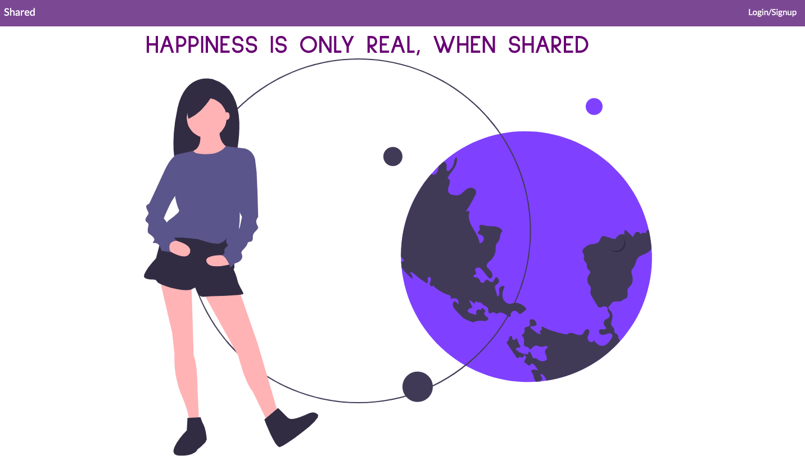
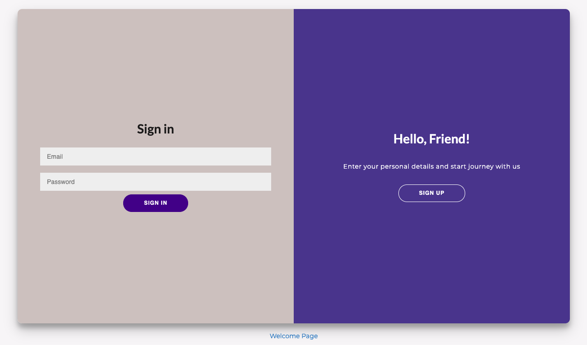
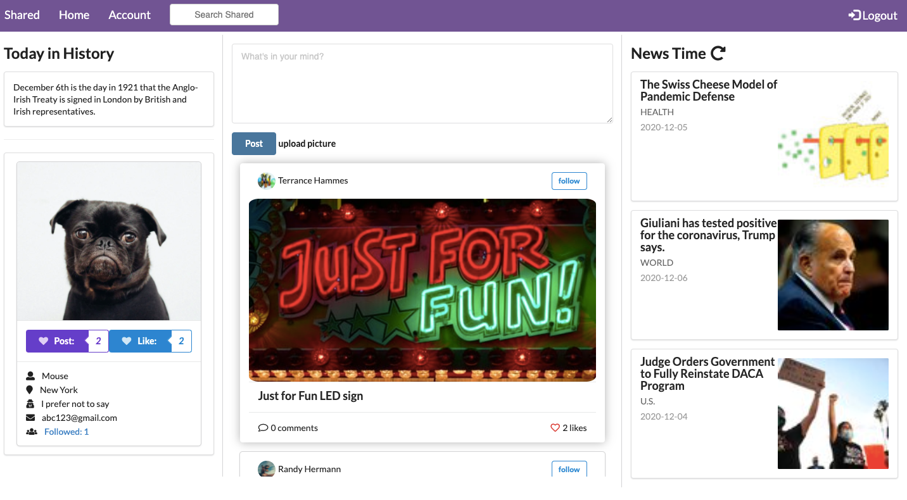

<h1>Shared</h1>

## Table of Content
<ul>
  <li><a href="#About">About</a></li>
  <li><a href="#Features">Features</a></li>
  <li><a href="#Stacks">Stacks</a></li>
</ul>

## About

 Rotten Potatoes is New Yokers' local guide to discover the best restaurants around you. Rotten Potatoes is implemented with zomato API, users can search the restaurants with location or name with ease. Users can also check out the restaurants reviews from other users. Leave reviews to the restaurants they've been to.

     
     
     

## Features
  <ul>
      <li>Developed a responsive front-end with React.js (full CRUD) with dynamic search features.</li>
      <li>Integrated with reusable components. Used JSX with ES6 to define components.</li>
      <li>Integrated Semantic UI to ensure delightful user experiences.</li>
      <li>Designed RESTful API on Rails API, using ActiveModel Serialization to create custom json objects.</li>
      <li>Built self-referential association to establish follow and unfollow relationships.</li>
  </ul>
  

## Stacks
  <ul>
    <li>JavaScript</li>
    <li>Ruby on Rails API</li>
    <li>Semantic UI</li>
    <li>React</li>
  </ul>
